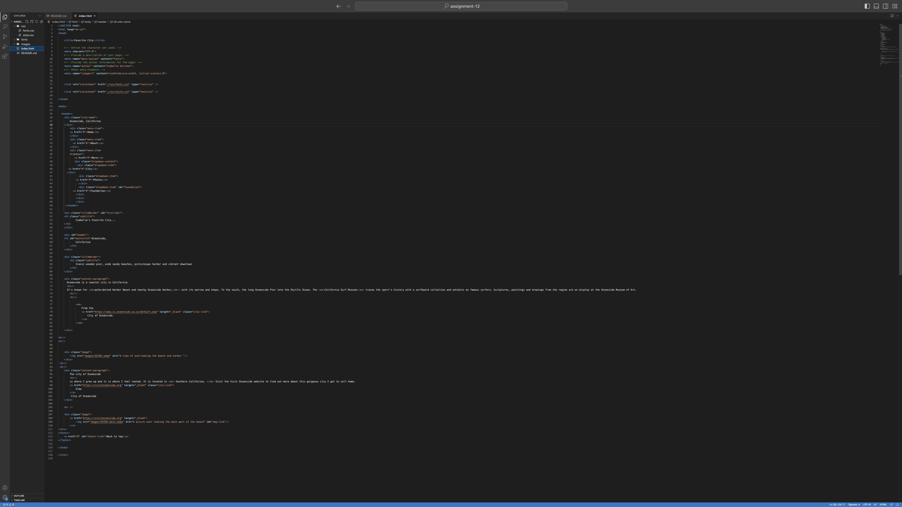
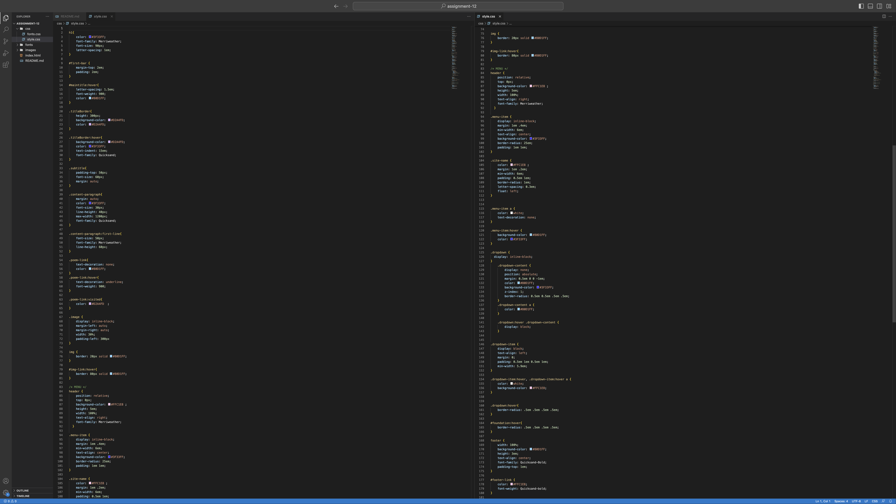
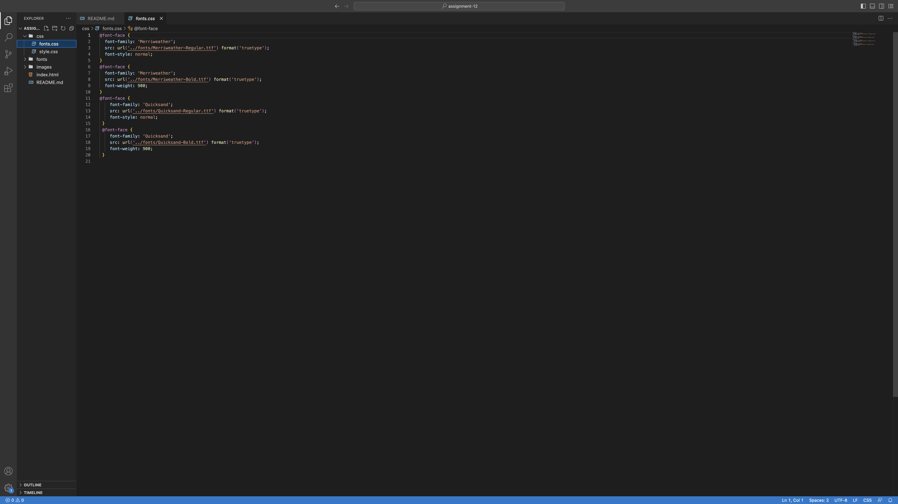

What is the difference between padding, margin, and borders?
    Padding is the amount of space between the inner content of the element and the element itself. Borders are a portion of the box can be separately colored, and has multiple style options. It is utilized for visual styling techniques and space management. Margins are the space between the box/element and other elements, or the edge of the parent element.
Optional: how did this week's assignment go? What challenges did you face, and how did you overcome them?
    Overall I thought it was pretty easy to follow. I struglled a little with linking fonts but i think I was able to download and add them to the files. 
Links to screenshot

